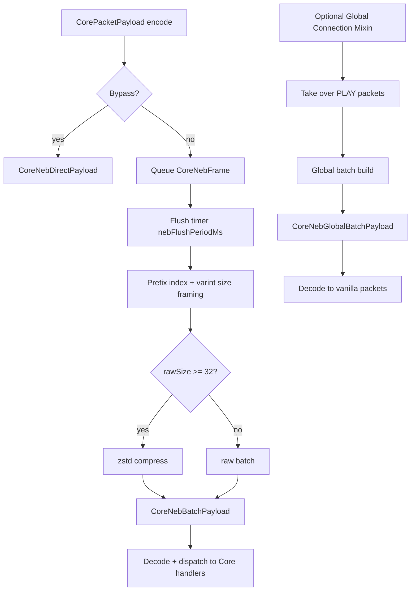

# LTSXCore NEB Integration Kernel Monograph

## Abstract
In this work, we present the NEB (Not Enough Bandwidth) integration kernel implemented in `ltsxcore`, derived from the core ideas stated in [NotEnoughBandwidth/README.md](../NotEnoughBandwidth/README.md): compact packet-type headers, packet aggregation, and conditional compression.  
Unlike vanilla-wide replacement, the core design provides two controllable integration paths: a **CoreNetwork-owned NEB path** and an optional **Global Connection Mixin NEB path**. The resulting system preserves protocol compatibility while reducing transport overhead for high-frequency custom payload traffic.

## Figure 1. Integration Architecture


## 1. Integration Scope
This document describes the kernel-level support that `ltsxcore` provides for NEB-style transport optimization:

1. Prefix compaction for payload type ids.
2. Scheduled packet aggregation with configurable flush interval.
3. Zstd compression with per-link context reuse.
4. Compatibility bypass path for sensitive packet types.
5. Runtime observability for baked/raw traffic and per-type flow.

The implementation basis is:

- [NotEnoughBandwidth/README.md](../NotEnoughBandwidth/README.md)
- [CoreNetwork.java](/D:/Projects/Minecraft/BotWMCS/ltsx_neo_mods/ltsxcore-1.21.1/src/main/java/link/botwmcs/core/net/CoreNetwork.java)
- [CoreNebAggregationManager.java](/D:/Projects/Minecraft/BotWMCS/ltsx_neo_mods/ltsxcore-1.21.1/src/main/java/link/botwmcs/core/net/neb/CoreNebAggregationManager.java)
- [CoreNebGlobalAggregationManager.java](/D:/Projects/Minecraft/BotWMCS/ltsx_neo_mods/ltsxcore-1.21.1/src/main/java/link/botwmcs/core/net/neb/global/CoreNebGlobalAggregationManager.java)

## 2. Support Matrix
| Capability | CoreNetwork NEB mode | Global Mixin NEB mode |
|---|---|---|
| Trigger point | `CoreNetwork.sendToPlayer/sendToServer` | `Connection.send(...)` interception |
| Traffic domain | Core payload bus only | PLAY-phase packets (subject to checks) |
| Batch payload | `core_neb_batch` | `core_neb_global_batch` |
| Bypass payload | `core_neb_direct` | direct resend of original packet |
| Prefix compact id | yes (`CoreNebPacketPrefixHelper`) | yes (`CoreNebGlobalPacketPrefixHelper`) |
| Compression gate | `rawSize >= 32` | `rawSize >= 32` |
| Compression engine | zstd (magicless, level 3) | zstd (magicless, level 3) |
| Flush schedule | `nebFlushPeriodMs` | `nebFlushPeriodMs` |
| Bypass control | `nebCompatibleMode` + `nebBlackList` | same + global fixed bypass types |
| Statistics model | core NEB counters | global NEB counters (ratio is NEB batch only) |

## 3. Prefix and Frame Design

### 3.1 Compact Prefix Header (README-aligned)
> [!NOTE]
> ### Fixed 8 bits header
> ```
> ┌------------- 1 byte (8 bits) ---------------┐
> │               function flags                │
> ├---┬---┬-------------------------------------┤
> │ i │ t │      reserved (6 bits)              │
> └---┴---┴-------------------------------------┘
> ```
> - `i = 0`: raw `ResourceLocation` id follows.
> - `i = 1, t = 0`: 12-bit namespace + 12-bit path (4-byte prefix form).
> - `i = 1, t = 1`: 8-bit namespace + 8-bit path (3-byte tight form).

Index constraints in core implementation:

- Maximum `4096` namespaces.
- Maximum `4096` paths per namespace.

### 3.2 Core Batch Wire Layout
> [!NOTE]
> ```
> ┌---┬-------┬----------------------------------------------┐
> │ C │  R?   │ payload                                      │
> └---┴-------┴----------------------------------------------┘
> C: bool compressed flag
> R: varint rawSize (exists only when C=true)
> payload: compressed-bytes or raw-frame-stream
> ```
>
> Raw frame stream:
> ```
> ┌----┬----┬----┬----┬----┬----┬----...
> │ p0 │ s0 │ d0 │ p1 │ s1 │ d1 │ ...
> └----┴----┴----┴----┴----┴----┴----...
> p = NEB compact prefix
> s = varint frame size
> d = frame bytes
> ```

### 3.3 Global Batch Wire Layout
Global mode keeps the same outer envelope (`C`, optional `R`) and uses:

```
[varint packetSize][packetBytes][varint packetSize][packetBytes]...
```

Each packet is re-decoded with the current inbound protocol codec and then passed into `context.handle(packet)`.

## 4. Runtime Procedure

### 4.1 CoreNetwork mode
1. Encode `CorePacketPayload` with registered codec.
2. If bypass type, flush pending queue and send `core_neb_direct`.
3. Otherwise enqueue frame `(type, encodedBytes)`.
4. Timer flush builds batch, optionally compresses, and sends `core_neb_batch`.
5. Receiver decodes batch and dispatches payload handler by type.

### 4.2 Global mixin mode
1. Intercept `Connection.send` in PLAY phase (non-local connections).
2. If connection cannot be safely taken over, fallback to vanilla send.
3. If packet type is bypass, flush queue first then pass through.
4. Otherwise buffer packet; scheduled flush emits `core_neb_global_batch`.
5. Receiver reconstructs original packets and invokes vanilla handlers.

## 5. Configuration Table
Configuration keys are defined in `CoreConfig` (common config):

| Key | Type | Range / Default | Semantics |
|---|---|---|---|
| `nebCompatibleMode` | bool | default `false` | Enables compatibility bypass list |
| `nebBlackList` | list<string> | default includes command / velocity related ids | Bypass packet ids |
| `nebContextLevel` | int | `[21,25]`, default `23` | zstd window log2 (`2MB` to `32MB`) |
| `nebFlushPeriodMs` | int | `[1,200]`, default `20` | Aggregation flush interval |
| `nebDebugLog` | bool | default `false` | Emits compression debug logs |
| `nebGlobalMixinEnabled` | bool | default `false` | Enables global Connection-level takeover |
| `nebGlobalFullPacketStat` | bool | default `false` | Adds BYPASS packet accounting in global mode |

## 6. Measurement Model
The traffic interface records both baked and raw bytes:

$$
\mathrm{ratio}_{in} = \frac{\mathrm{inbound\_baked}}{\mathrm{inbound\_raw}},\quad
\mathrm{ratio}_{out} = \frac{\mathrm{outbound\_baked}}{\mathrm{outbound\_raw}}
$$

In global mixin mode, the ratio line is defined on NEB batch traffic only.

## 7. Fallback and Safety Semantics
| Scenario | Behavior |
|---|---|
| Type in bypass list | Pending queue is flushed first, then packet uses bypass path |
| Compression failure (global mode) | Falls back to uncompressed batch payload |
| Invalid prefix decode (global type codec) | Attempts raw id fallback; throws when still invalid |
| Connection disconnected | Associated zstd context is evicted |
| Unsupported connection for global takeover | Packets are sent using original vanilla path |

## 8. Practical Recommendations
1. Start with `nebGlobalMixinEnabled = false` and validate CoreNetwork payload behavior first.
2. Keep `nebFlushPeriodMs = 20` unless latency budget requires a different value.
3. Raise `nebContextLevel` only when memory budget allows it.
4. Keep frequently ordered/sensitive packets in `nebBlackList` when interoperability is prioritized.
