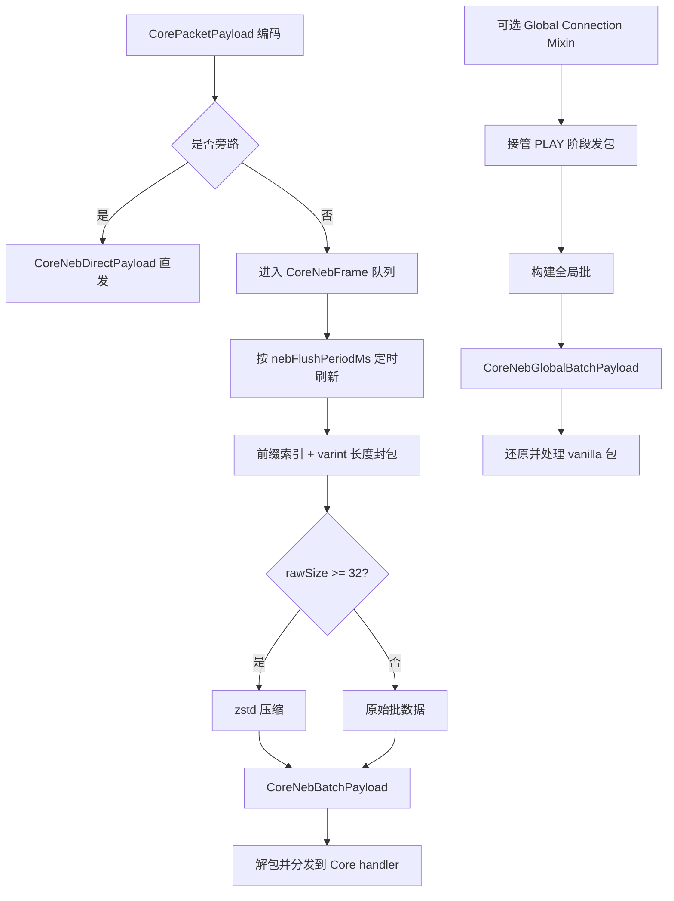

# LTSXCore NEB 集成内核技术说明

## 摘要
本文给出 `ltsxcore` 中 NEB（Not Enough Bandwidth）集成内核的完整说明。该内核继承 [NotEnoughBandwidth/README.md](../NotEnoughBandwidth/README.md) 的三项核心思想：**包类型前缀紧凑化、周期性聚合、条件压缩**。  
与“全局替换式改造”不同，本实现提供两条可控路径：**CoreNetwork 专用总线路径** 与 **可选的全局 Connection Mixin 路径**。系统目标是在协议兼容前提下，降低高频自定义载荷传输的字节开销。

## 图 1. 集成架构总览


## 1. 集成范围
本文覆盖 `ltsxcore` 对 NEB 集成内核的支持能力：

1. 载荷类型 id 的前缀压缩编码。
2. 可配置周期的聚合发送。
3. 基于链路上下文复用的 zstd 压缩。
4. 面向兼容性的旁路发送机制。
5. baked/raw 与分类型流量观测能力。

实现依据文件：

- [NotEnoughBandwidth/README.md](../NotEnoughBandwidth/README.md)
- [CoreNetwork.java](/D:/Projects/Minecraft/BotWMCS/ltsx_neo_mods/ltsxcore-1.21.1/src/main/java/link/botwmcs/core/net/CoreNetwork.java)
- [CoreNebAggregationManager.java](/D:/Projects/Minecraft/BotWMCS/ltsx_neo_mods/ltsxcore-1.21.1/src/main/java/link/botwmcs/core/net/neb/CoreNebAggregationManager.java)
- [CoreNebGlobalAggregationManager.java](/D:/Projects/Minecraft/BotWMCS/ltsx_neo_mods/ltsxcore-1.21.1/src/main/java/link/botwmcs/core/net/neb/global/CoreNebGlobalAggregationManager.java)

## 2. 支持矩阵
| 能力项 | CoreNetwork NEB 模式 | Global Mixin NEB 模式 |
|---|---|---|
| 触发入口 | `CoreNetwork.sendToPlayer/sendToServer` | 拦截 `Connection.send(...)` |
| 作用流量域 | 仅 Core 总线载荷 | PLAY 阶段包（通过安全校验后） |
| 批传输载荷 | `core_neb_batch` | `core_neb_global_batch` |
| 旁路载荷 | `core_neb_direct` | 保持原包直通 |
| 前缀紧凑编码 | 支持（`CoreNebPacketPrefixHelper`） | 支持（`CoreNebGlobalPacketPrefixHelper`） |
| 压缩阈值 | `rawSize >= 32` | `rawSize >= 32` |
| 压缩实现 | zstd（magicless，level 3） | zstd（magicless，level 3） |
| 刷新节拍 | `nebFlushPeriodMs` | `nebFlushPeriodMs` |
| 兼容旁路 | `nebCompatibleMode` + `nebBlackList` | 同前，并含全局固定旁路类型 |
| 统计口径 | Core NEB 计数器 | Global NEB 计数器（比例按 NEB batch 口径） |

## 3. 前缀与帧设计

### 3.1 紧凑前缀头（与 README 表达保持一致）
> [!NOTE]
> ### 固定 8 bit 头
> ```
> ┌------------- 1 byte (8 bits) ---------------┐
> │               function flags                │
> ├---┬---┬-------------------------------------┤
> │ i │ t │      reserved (6 bits)              │
> └---┴---┴-------------------------------------┘
> ```
> - `i = 0`：后续写入原始 `ResourceLocation`。
> - `i = 1, t = 0`：12-bit namespace + 12-bit path（4 字节前缀形态）。
> - `i = 1, t = 1`：8-bit namespace + 8-bit path（3 字节紧凑形态）。

内核索引容量约束：

- namespace 最大 `4096`。
- 每个 namespace 的 path 最大 `4096`。

### 3.2 Core 批封装格式
> [!NOTE]
> ```
> ┌---┬-------┬----------------------------------------------┐
> │ C │  R?   │ payload                                      │
> └---┴-------┴----------------------------------------------┘
> C: bool 压缩标志
> R: varint 原始长度（仅 C=true 存在）
> payload: 压缩字节流 或 原始帧流
> ```
>
> 原始帧流：
> ```
> ┌----┬----┬----┬----┬----┬----┬----...
> │ p0 │ s0 │ d0 │ p1 │ s1 │ d1 │ ...
> └----┴----┴----┴----┴----┴----┴----...
> p = NEB 前缀
> s = varint 帧长度
> d = 帧字节
> ```

### 3.3 Global 批封装格式
Global 模式外层包络与 Core 模式一致（`C` + 可选 `R`），内层载荷为：

```
[varint packetSize][packetBytes][varint packetSize][packetBytes]...
```

接收端按当前 inbound protocol codec 逐包反序列化，并通过 `context.handle(packet)` 继续 vanilla 处理流程。

## 4. 运行流程

### 4.1 CoreNetwork 模式
1. 使用已注册 codec 编码 `CorePacketPayload`。
2. 若命中旁路类型，先刷新待发队列，再发送 `core_neb_direct`。
3. 否则将 `(type, encodedBytes)` 入队。
4. 定时任务刷新队列，构造批并按条件压缩，发送 `core_neb_batch`。
5. 接收端逐帧解包，并按类型分发到对应 Core handler。

### 4.2 Global Mixin 模式
1. 在 PLAY 阶段拦截 `Connection.send`（非本地连接）。
2. 若连接不满足接管条件，立即回退 vanilla 原路径。
3. 若命中旁路类型，先刷新缓存再放行该包。
4. 其余包进入缓存；周期刷新后发送 `core_neb_global_batch`。
5. 接收端还原原始包并继续 vanilla 处理。

## 5. 配置参数表
参数定义位于 `CoreConfig`（COMMON）：

| 参数 | 类型 | 取值 / 默认值 | 语义 |
|---|---|---|---|
| `nebCompatibleMode` | bool | 默认 `false` | 开启兼容旁路策略 |
| `nebBlackList` | list<string> | 默认含 command/velocity 相关 id | 指定旁路包类型 |
| `nebContextLevel` | int | `[21,25]`，默认 `23` | zstd 窗口 log2（`2MB`~`32MB`） |
| `nebFlushPeriodMs` | int | `[1,200]`，默认 `20` | 聚合刷新周期 |
| `nebDebugLog` | bool | 默认 `false` | 输出压缩调试日志 |
| `nebGlobalMixinEnabled` | bool | 默认 `false` | 开启全局 Connection 接管模式 |
| `nebGlobalFullPacketStat` | bool | 默认 `false` | 全局模式记录 BYPASS 分流统计 |

## 6. 观测模型
内核同时记录 baked/raw 字节总量与速率，比例定义为：

$$
\mathrm{ratio}_{in} = \frac{\mathrm{inbound\_baked}}{\mathrm{inbound\_raw}},\quad
\mathrm{ratio}_{out} = \frac{\mathrm{outbound\_baked}}{\mathrm{outbound\_raw}}
$$

在 Global 模式下，界面比例线采用 NEB batch 口径。

## 7. 回退与安全语义
| 场景 | 系统行为 |
|---|---|
| 命中旁路列表 | 先刷新当前聚合，再走旁路/直发 |
| Global 压缩异常 | 回退为不压缩批传输 |
| 全局前缀解码异常 | 回退尝试原始 id 解码，仍非法则抛错 |
| 连接断开 | 清理对应 zstd 上下文 |
| 不满足全局接管条件 | 完整回退 vanilla 发送路径 |

## 8. 实践建议
1. 首次接入建议先保持 `nebGlobalMixinEnabled = false`，先验证 Core 总线路径。
2. `nebFlushPeriodMs = 20` 可作为起始值，在延迟预算压力下再调整。
3. 仅在内存预算充足时提高 `nebContextLevel`。
4. 对顺序敏感或强兼容包，建议显式加入 `nebBlackList`。
