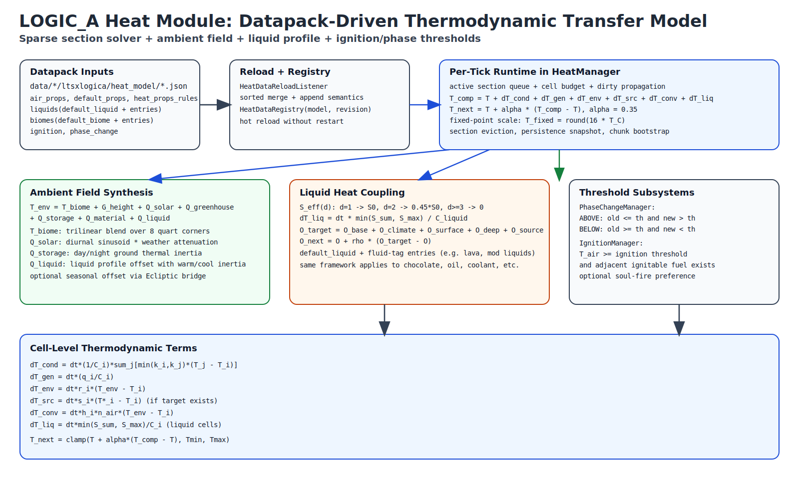

# LOGIC_A 热力系统技术说明书

## 摘要
`logica` 的 heat 模块在方块空间上实现了稀疏激活、预算约束、数据包驱动的热力场。其核心数值方法是显式迭代 + 欠松弛的有限体积风格更新，并叠加热源项、环境耦合项、液体耦合项，以及基于阈值的点火与相变子系统。本文给出运行机制、完整数据包参数、全部公式（LaTeX）及调参方法。

## 图：Heat 模块传热模型


## 1. 运行架构
运行流程如下：

1. 从 `data/<namespace>/ltsxlogica/heat_model/*.json` 读取数据包。
2. 按资源 id 字典序合并。
3. 合并结果写入 `HeatDataRegistry`。
4. `HeatManager` 在每个维度按 tick 预算执行热场迭代。
5. `PhaseChangeManager` 与 `IgnitionManager` 消费温度阈值事件。

系统特征：

- 以 dirty cell 与 active section 为核心的稀疏激活。
- 以 section（`16^3`）为单位的延迟创建与回收。
- 温度使用定点数存储（`1/16 °C` 分辨率）。
- 数据包热重载全量生效。

## 2. 控制方程（LaTeX）

### 2.1 定点温度表示
$$
T_f = \operatorname{round}(16\,T_c), \qquad T_c = \frac{T_f}{16}
$$
用途：

- \(T_f\)：运行时整数温度。
- \(T_c\)：配置与分析时使用的摄氏温度。

### 2.2 单元热更新（6 邻域）
对单元 \(i\)，邻域 \(N_6(i)\)：

$$
k_{ij} = \min(k_i, k_j)
$$

$$
\Delta T_i^{\mathrm{cond}}
= \Delta t \cdot \frac{1}{C_i}
\sum_{j\in N_6(i)} k_{ij}(T_j - T_i)
$$

$$
\Delta T_i^{\mathrm{gen}} = \Delta t \cdot \frac{q_i}{C_i}
$$

$$
\Delta T_i^{\mathrm{env}} = \Delta t \cdot r_i(T_{\mathrm{env}} - T_i)
$$

$$
\Delta T_i^{\mathrm{src}}
=
\begin{cases}
\Delta t \cdot s_i(T_i^\star - T_i), & \text{存在 target 时}\\
0, & \text{否则}
\end{cases}
$$

$$
\Delta T_i^{\mathrm{conv}}
= \Delta t \cdot h_i \cdot n_{\mathrm{air}}(T_{\mathrm{env}} - T_i)
$$

$$
\Delta T_i^{\mathrm{liq}}
= \Delta t \cdot \frac{\min(S_i, S_{\max})}{C_i}
$$

$$
T_i^{\mathrm{comp}} =
\operatorname{clamp}\!\left(
T_i +
\Delta T_i^{\mathrm{cond}} +
\Delta T_i^{\mathrm{gen}} +
\Delta T_i^{\mathrm{env}} +
\Delta T_i^{\mathrm{src}} +
\Delta T_i^{\mathrm{conv}} +
\Delta T_i^{\mathrm{liq}}
\right)
$$

$$
T_i^{t+1}
= \operatorname{clamp}\!\left(
T_i^{t} + \alpha\,(T_i^{\mathrm{comp}} - T_i^{t})
\right),
\quad \alpha=0.35
$$

用途：

- \(k_i, C_i, q_i, r_i, s_i, h_i\) 均来自 `HeatProps`。
- \(n_{\mathrm{air}}\) 为 6 个方向上空气邻面计数。
- \(S_i\) 来自液体 `source_rules` 的热源累加。
- 欠松弛 \(\alpha\) 用于数值稳定与抑制振荡。

### 2.3 更新周期门控
不同材质可使用不同更新周期：

$$
\mathbb{I}_i(t)=
\mathbf{1}\!\left[
\left(t+\lambda_i\right)\bmod p_i = 0
\right]
$$

用途：

- \(p_i=\texttt{update\_period\_ticks}\)。
- \(\lambda_i\) 由 section 相位和 cell 索引确定。

### 2.4 环境温度场
$$
T_{\mathrm{env}}
=
T_{\mathrm{biome}}
+
G_{\mathrm{height}}
+
Q_{\mathrm{solar}}
+
Q_{\mathrm{greenhouse}}
+
Q_{\mathrm{storage}}
+
Q_{\mathrm{material}}
+
Q_{\mathrm{liquid}}
$$

其中：

$$
G_{\mathrm{height}} = \left\lfloor \frac{\mathrm{seaLevel}-y}{8} \right\rfloor
$$

$$
Q_{\mathrm{solar}}
= D_{\max}\,I_{\odot}\,E_{\mathrm{solar}}
\cdot\left(0.35 + 0.65(1-E_{\mathrm{enc}})\right)
$$

$$
Q_{\mathrm{greenhouse}}
= G_{\max}\,I_{\odot}\,E_{\mathrm{gh}}
$$

$$
Q_{\mathrm{storage}}
= T_{\mathrm{ground}}\cdot
\operatorname{clamp}\!\left(
0.20 + 0.65(1-E_{\mathrm{enc}}) + 0.15(1-E_{\mathrm{ins}}),
0.12, 1.0
\right)
$$

$$
Q_{\mathrm{material}} = B_{\mathrm{mat}}\cdot E_{\mathrm{enc}}
$$

用途：

- \(E_{\mathrm{enc}},E_{\mathrm{solar}},E_{\mathrm{gh}},E_{\mathrm{ins}}\) 为 Q8 微气候系数。
- \(T_{\mathrm{ground}}\) 为昼夜地表储热状态。
- \(Q_{\mathrm{liquid}}\) 为液体模型附加偏移。

### 2.5 日照强度与地表储热动力学
$$
I_{\odot}
=
\operatorname{clamp}\!\left(
\max\!\left(0,\sin\!\frac{2\pi t_{\mathrm{day}}}{24000}\right)\cdot w_{\mathrm{weather}},
0,1
\right)
$$

其中 \(w_{\mathrm{weather}}=1.0\)（晴天）、\(0.60\)（雨）、\(0.35\)（雷暴）。

$$
T_{\mathrm{ground}}^\star
= \operatorname{lerp}(I_{\odot}, T_{\mathrm{night}}, T_{\mathrm{day}})
$$

$$
T_{\mathrm{ground}}^{t+1}
=
\operatorname{clamp}\!\left(
T_{\mathrm{ground}}^{t}
 + \beta (T_{\mathrm{ground}}^\star - T_{\mathrm{ground}}^{t}),
\pm T_{\mathrm{limit}}
\right)
$$

其中 \(\beta=0.028\)（白天充能），\(\beta=0.010\)（夜间释能）。

### 2.6 生物群系三线性平滑
群系基温由 8 个 quart 角点平滑得到：

$$
T_{\mathrm{biome}}=
\frac{1}{64}
\sum_{a,b,c\in\{0,1\}}
w_x^{(a)}w_y^{(b)}w_z^{(c)}
\,T_{\mathrm{biome}}(q_x+a,q_y+b,q_z+c)
$$

用途：

- 消除生物群系边界的硬跳变。
- `BiomeAmbientModel` 先按数据包规则求基温，再叠加季节偏移（可选）。

### 2.7 液体目标偏移与惯性
$$
O_{\mathrm{target}}
=
\operatorname{clamp}\!\left(
O_{\mathrm{base}} + O_{\mathrm{climate}} + O_{\mathrm{surface}} + O_{\mathrm{deep}} + O_{\mathrm{source}},
[O_{\min}, O_{\max}]
\right)
$$

$$
O_{\mathrm{climate}} = 0.08\,(T_{\mathrm{biome}}-14^\circ C)
$$

$$
O_{\mathrm{surface}}
= O_{\mathrm{solar,max}} I_{\odot}E_{\mathrm{sky}}
\operatorname{clamp}\!\left(1-\frac{d_{\mathrm{surface}}}{14},0,1\right)
$$

$$
O_{\mathrm{deep}}
=
-\min\!\left(
O_{\mathrm{deep,max}},
(d_{\mathrm{sea}}+\frac{d_{\mathrm{surface}}}{2})\,O_{\mathrm{deep,blk}}
\right)
$$

$$
O_{\mathrm{source}}
=
\operatorname{clamp}\!\left(
\sum S_{\mathrm{direct}} + 0.45\sum S_{\mathrm{indirect}},
[0,S_{\max}]
\right)
$$

$$
O^{t+1} =
\operatorname{clamp}\!\left(
O^t + \rho(O_{\mathrm{target}}-O^t),
[O_{\min},O_{\max}]
\right)
$$

用途：

- 升温使用 `inertia_warm_rate`，降温使用 `inertia_cool_rate`。
- 所有进入 liquid 模型的流体（含模组流体）统一服从该方程。

### 2.8 相变与点火阈值判定
相变越阈条件：

$$
\text{ABOVE}: \quad T_{\mathrm{old}}\le\theta \land T_{\mathrm{new}}>\theta
$$

$$
\text{BELOW}: \quad T_{\mathrm{old}}\ge\theta \land T_{\mathrm{new}}<\theta
$$

点火条件（空气单元）：

$$
T_{\mathrm{air}}\ge T_{\mathrm{ign}}
\land
\exists \text{ 邻接可燃料}
$$

## 3. 数据包发现与合并规则
路径：

`data/<namespace>/ltsxlogica/heat_model/*.json`

合并流程：

1. 以内置默认模型为起点。
2. 按资源 id 字典序排序。
3. 逐文件合并。
4. 数组默认替换，若开启 append 标志则追加。

可用 append 标志：

- `append_heat_props_rules`
- `liquids.append_entries`
- `liquids.default_liquid.append_source_rules`
- `liquids.entries[*].profile.append_source_rules`
- `biomes.append_entries`
- `phase_change.append_rules`

兼容字段：

- 根节点 `water` 仍可用，内部映射到 `liquids.default_liquid`。
- `biomes.default_ambient_celsius` 为旧写法兼容键。

## 4. `heat_model` 完整结构（所有参数）

```json
{
  "air_props": { "HeatProps" },
  "default_props": { "HeatProps" },
  "heat_props_rules": [
    {
      "match": { "BlockMatcher" },
      "props": { "HeatProps" }
    }
  ],
  "append_heat_props_rules": false,

  "liquids": {
    "default_liquid": {
      "heat_props": { "HeatProps" },
      "surface_scan_steps": 24,
      "inertia_evict_interval_ticks": 200,
      "inertia_evict_idle_ticks": 1800,
      "base_cool_offset_celsius": -3.2,
      "surface_solar_max_celsius": 6.0,
      "deep_cool_per_block_celsius": 0.18,
      "deep_cool_max_celsius": 16.0,
      "heat_source_max_celsius": 18.0,
      "target_min_celsius": -24.0,
      "target_max_celsius": 22.0,
      "inertia_warm_rate": 0.012,
      "inertia_cool_rate": 0.02,
      "source_rules": [
        {
          "match": { "BlockMatcher" },
          "contribution_celsius": 12.0
        }
      ],
      "append_source_rules": false
    },
    "entries": [
      {
        "match": { "FluidMatcher" },
        "profile": { "LiquidProfile" }
      }
    ],
    "append_entries": false
  },

  "water": { "LiquidProfile（旧版兼容，等价于 liquids.default_liquid）" },

  "biomes": {
    "default_biome": { "ambient_celsius": 18.0 },
    "default_ambient_celsius": 18.0,
    "entries": [
      {
        "match": { "BiomeMatcher" },
        "ambient_celsius": 35.0
      }
    ],
    "append_entries": false
  },

  "ignition": {
    "air_threshold_celsius": 280.0,
    "respect_fire_tick_gamerule": true,
    "use_ignitable_tag": true,
    "use_vanilla_flammable": true,
    "result_block": "minecraft:fire",
    "prefer_soul_fire_on_soul_base": true
  },

  "phase_change": {
    "require_pcm_tag": true,
    "rules": [
      {
        "match": { "BlockMatcher" },
        "direction": "above",
        "threshold_celsius": 1.0,
        "result_block": "minecraft:water",
        "ultrawarm_result_block": "minecraft:air",
        "require_source_fluid": false
      }
    ],
    "append_rules": false
  }
}
```

## 5. 参数说明（完整）

### 5.1 `HeatProps`（用于 `air_props`、`default_props`、规则 `props`、液体 `heat_props`）

| 参数 | 类型 | 单位 | 含义 | 运行时约束 |
|---|---:|---:|---|---|
| `conductivity_k` | float | 相对量 | 导热系数 \(k\) | `>=0` |
| `capacity_c` | float | 相对量 | 热容 \(C\) | `>=0.05` |
| `generation_q` | float | 每步固定温增项 | 内部热生成 \(q\) | 不强制正值 |
| `relax_r` | float | 1/步 | 环境回归系数 \(r\) | `>=0` |
| `target_celsius` | float | °C | 目标温度 \(T^\star\) | 可选 |
| `source_strength_s` | float | 1/步 | 热源耦合系数 \(s\) | `>=0`，`<=0` 时禁用 target |
| `convective_h` | float | 1/(面·步) | 对流系数 \(h\) | `>=0` |
| `update_period_ticks` | int | tick | 更新周期 | `>=1` |
| `air_like` | bool | - | 气相/轻质类别标记 | 本身不直接参与数值项 |

### 5.2 `BlockMatcher`

| 参数 | 类型 | 说明 |
|---|---|---|
| `block` | string | 方块 id，支持 `#tag` 简写。 |
| `tag` | string | 显式方块标签 id。 |
| `lit` | bool | 要求 blockstate 的 `lit` 值匹配。 |
| `soul_base` | bool | 要求“火是否在灵魂基底上”状态匹配。 |

### 5.3 `FluidMatcher`

| 参数 | 类型 | 说明 |
|---|---|---|
| `fluid` | string | 流体 id，支持 `#tag` 简写。 |
| `tag` | string | 显式流体标签 id。 |

### 5.4 `BiomeMatcher`

| 参数 | 类型 | 说明 |
|---|---|---|
| `biome` | string | 群系 id，支持 `#tag` 简写。 |
| `tag` | string | 显式群系标签 id。 |

### 5.5 `liquids.default_liquid` 与 `liquids.entries[*].profile`

| 参数 | 类型 | 单位 | 含义 |
|---|---:|---:|---|
| `heat_props` | object | - | 该液体的 `HeatProps` |
| `surface_scan_steps` | int | 格 | 向上扫描液面最大步长 |
| `inertia_evict_interval_ticks` | int | tick | 惯性缓存清理周期 |
| `inertia_evict_idle_ticks` | int | tick | 惯性缓存空闲淘汰阈值 |
| `base_cool_offset_celsius` | float | °C | 液体基础偏移 |
| `surface_solar_max_celsius` | float | °C | 表面太阳吸热上限 |
| `deep_cool_per_block_celsius` | float | °C/格 | 深度冷却梯度 |
| `deep_cool_max_celsius` | float | °C | 深度冷却绝对上限 |
| `heat_source_max_celsius` | float | °C | 热源叠加上限 |
| `target_min_celsius` | float | °C | 偏移目标下限 |
| `target_max_celsius` | float | °C | 偏移目标上限 |
| `inertia_warm_rate` | float | 1/步 | 升温惯性率 |
| `inertia_cool_rate` | float | 1/步 | 降温惯性率 |
| `source_rules` | array | - | 液体热源规则 |
| `append_source_rules` | bool | - | 追加或替换热源规则 |

### 5.6 `source_rules[*]`

| 参数 | 类型 | 单位 | 含义 |
|---|---:|---:|---|
| `match` | object | - | `BlockMatcher` |
| `contribution_celsius` | float | °C | 热源贡献（容量缩放前） |

### 5.7 `biomes`

| 参数 | 类型 | 单位 | 含义 |
|---|---:|---:|---|
| `default_biome.ambient_celsius` | float | °C | 未匹配时默认群系温度 |
| `default_ambient_celsius` | float | °C | 旧版兼容默认键 |
| `entries` | array | - | 群系规则列表 |
| `append_entries` | bool | - | 追加或替换群系列表 |

### 5.8 `biomes.entries[*]`

| 参数 | 类型 | 单位 | 含义 |
|---|---:|---:|---|
| `match` | object | - | `BiomeMatcher` |
| `ambient_celsius` | float | °C | 匹配群系环境基温 |

### 5.9 `ignition`

| 参数 | 类型 | 单位 | 含义 |
|---|---:|---:|---|
| `air_threshold_celsius` | float | °C | 点火判定空气温阈 |
| `respect_fire_tick_gamerule` | bool | - | 是否受 `doFireTick` 约束 |
| `use_ignitable_tag` | bool | - | 是否使用 `ltsxlogica:ignitable` |
| `use_vanilla_flammable` | bool | - | 是否启用原版可燃性判定 |
| `result_block` | string | - | 点火后放置方块 |
| `prefer_soul_fire_on_soul_base` | bool | - | 灵魂基底优先转灵魂火 |

### 5.10 `phase_change`

| 参数 | 类型 | 单位 | 含义 |
|---|---:|---:|---|
| `require_pcm_tag` | bool | - | 是否要求方块属于 `ltsxlogica:pcm` |
| `rules` | array | - | 相变规则列表 |
| `append_rules` | bool | - | 追加或替换规则 |

### 5.11 `phase_change.rules[*]`

| 参数 | 类型 | 单位 | 含义 |
|---|---:|---:|---|
| `match` | object | - | `BlockMatcher` |
| `direction` | string | - | `"above"` 或 `"below"` |
| `threshold_celsius` | float | °C | 相变阈值 |
| `result_block` | string | - | 主结果方块 |
| `ultrawarm_result_block` | string | - | 超温维度覆盖结果 |
| `require_source_fluid` | bool | - | 是否要求源流体态 |

## 6. 热源-传递格数公式表

液体热源对目标单元的有效贡献 \(S_{\mathrm{eff}}(d)\)：

$$
S_{\mathrm{eff}}(d)=
\begin{cases}
S_0, & d=1\\
0.45\,S_0, & d=2 \text{ 且中间单元为空气或模型液体}\\
0, & d\ge 3
\end{cases}
$$

对 `default_liquid`：

- \(C=42\)
- 欠松弛 \(\alpha=0.35\)
- 单热源孤立近似温升：
  \(\Delta T_{\text{pre}} = S_{\mathrm{eff}}/C\)，
  \(\Delta T_{\text{post}} \approx \alpha\Delta T_{\text{pre}}\)

| 热源（`default_liquid`） | \(d=1\) 时 \(S_0\) (°C) | \(d=2\) 时 \(0.45S_0\) (°C) | \(\Delta T_{\text{pre}}(d=1)\) (°C/步) | \(\Delta T_{\text{pre}}(d=2)\) (°C/步) | \(\Delta T_{\text{post}}(d=1)\) (°C/步) | \(\Delta T_{\text{post}}(d=2)\) (°C/步) |
|---|---:|---:|---:|---:|---:|---:|
| 岩浆 | 12.0 | 5.4 | 0.2857 | 0.1286 | 0.1000 | 0.0450 |
| 岩浆块 | 8.0 | 3.6 | 0.1905 | 0.0857 | 0.0667 | 0.0300 |
| 火 | 6.0 | 2.7 | 0.1429 | 0.0643 | 0.0500 | 0.0225 |
| 灵魂火 | 4.5 | 2.025 | 0.1071 | 0.0482 | 0.0375 | 0.0169 |
| 营火（点燃） | 5.0 | 2.25 | 0.1190 | 0.0536 | 0.0416 | 0.0188 |
| 灵魂营火（点燃） | 4.0 | 1.8 | 0.0952 | 0.0429 | 0.0333 | 0.0150 |
| 熔炉/高炉/烟熏炉（点燃） | 3.5 | 1.575 | 0.0833 | 0.0375 | 0.0292 | 0.0131 |
| 火把族 | 1.8 | 0.81 | 0.0429 | 0.0193 | 0.0150 | 0.0068 |

注：

- 多热源叠加受 `heat_source_max_celsius` 截断。
- 实际温升还会被环境项、深度冷却项等共同影响。

## 7. 标签驱动层
当前 heat 使用的核心标签：

- `ltsxlogica:burnable`
- `ltsxlogica:ignitable`
- `ltsxlogica:pcm`
- `ltsxlogica:thermal_stone`
- `ltsxlogica:thermal_wood`
- `ltsxlogica:thermal_leaves`
- `ltsxlogica:thermal_ice`

建议策略：

- 用 `thermal_*` 批量表达材质热学参数，不逐方块硬编码。
- 用 `ignitable` 独立定义点火燃料，不依赖原版可燃性。
- 用 `pcm` 控制相变参与范围。
- 用 `liquids.entries[*].match.tag` 按流体类别批量建模。

## 8. 实践范式：液态巧克力海
实现“液态巧克力海”可按下述步骤：

1. 定义流体标签（例如 `modid:chocolate_liquid`）。
2. 在 `liquids.entries` 中添加 `match.tag = "modid:chocolate_liquid"`。
3. 配置该液体 `profile.heat_props`、惯性、深度冷却、热源规则。
4. 添加相变规则：
   - 液态巧克力在低温阈值下转固态巧克力方块。
   - 固态巧克力在高温阈值上转液态。
5. 若 `require_pcm_tag=true`，将相关方块纳入 `pcm` 标签。

这样，巧克力液体自动继承液体模型中的太阳吸热/放热、深度冷却、热源耦合与惯性行为。

