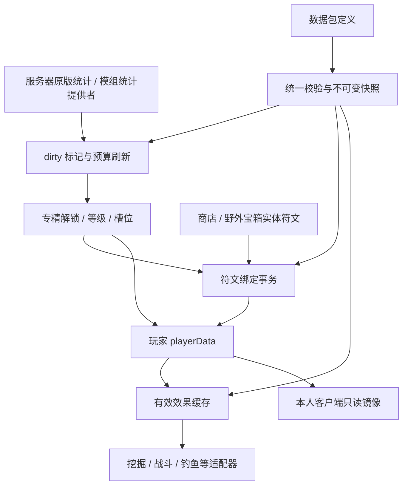

# LTSX Logic A Mastery 系统实现方案（MA0–MA8）

状态：整体设计方案；2026-10-04 已按用户缩小后的范围实现注册、存储、统计升级、接口和基础 Fizzy 应用界面。

本文最初仅用于设计评估。下文的完整阶段、接口、JSON、NBT、事件和命令仍是长期拟定契约，不能等同于当前实现；本次实际契约和使用方式见 [Mastery 第一期说明](../MASTERY_README_ZH.md)。符文效果执行、商店、野外宝箱和完整交互仍未实现。工期是整体工程估算，不是运行验证结果。

## 1. 结论与难度

**可行，整体难度中高；最难的是玩家符文的效果适配、生命周期与多人事务一致性。** 等级计算和数据包读取本身难度中等，现有 Core 能提供玩家 NBT、模块注册、服务注册与网络设施。

建议采用五层架构：统计数据源 → 专精进度 → 玩家槽位与绑定记录 → 符文效果适配 → 获取与交互。符文定义可以像附魔一样由数据包添加，但效果类型须有 Java 实现。不能承诺任意模组附魔只写 JSON 就自动成为玩家天赋。

| 工作项 | 难度 | 主要原因 |
|---|---|---|
| 玩家存档、死亡复制、迁移 | 中 | 要保证重登、死亡、跨维度及末地返回后数据完整，不能重复复制奖励 |
| 原版统计与多专精升级 | 中 | 统计事件时序、历史统计、筛选标签、重载及阈值变化 |
| 数据包定义、校验与同步 | 中 | 交叉引用、未知 ID、缺失模组、原子发布、客户端版本一致性 |
| 符文物品与槽位事务 | 中高 | 消耗、绑定、替换、返还、重放请求、满背包、掉线和存档一致性 |
| 效率／战斗／钓鱼效果 | 高 | 效果执行链不同，原版附魔、其他模组、客户端预测和服务器计算要一致 |
| 商店与野外宝箱 | 中 | 当前项目没有已核实的商店／经济实现，需要接口与具体接入方 |
| 通用第三方附魔适配 | 高且开放式 | 缺少玩家上下文、装备槽语义、弹射物与掉落上下文不能一概处理 |

单名熟悉 NeoForge 1.21.1 的开发者，基础闭环约 10–16 个工作日；含四个专精、首批效果、基础界面、真实商店接入和多人回归约 20–35 个工作日。第三方兼容范围、商店实现和美术不确定性会增加时间。先完成 MA0–MA4 并验证，再扩充效果。

## 2. 用户要求与建议默认值

### 2.1 已确定要求

- 系统属于 `ltsxlogica`，正式名为 mastery；数据记录在玩家 playerData。
- 玩家可以同时拥有多个专精，专精等级为 1–100；按玩家统计数据升级。
- 数据包可以添加专精、统计规则、符文系列、等级门槛及兼容适配。
- 每次升级提供一个可点亮的天赋槽位，槽位中可以放置一个符文。
- 符文的效果绑定玩家，换工具不解除；工具没有附魔时也能获得对应效果。
- 专精限制可放置的符文系列，例如 miners 为挖掘系列，knight 为战斗系列。
- 更强符文有更高专精等级门槛；效率 V 要求专精严格高于 50 级。
- 正常生存玩法的获取途径只有商店购买和野外宝箱，不提供合成。
- 提供其他模组可调用的统计、专精、等级、槽位、已应用符文及效果接口。

### 2.2 为使方案可实施而提出的默认规则

以下属于设计建议，不表示用户已逐项选定；实现前可调整，不妨碍本次完成方案。

| 问题 | 建议默认值 |
|---|---|
| 专精 ID | 使用 `ltsxlogica:miners`、`ltsxlogica:chief`、`ltsxlogica:fisher`、`ltsxlogica:knight`，保留用户命名；展示名独立。若以后改为 miner／chef，使用显式 ID 迁移，不静默改名 |
| 获得专精 | 满足定义中的解锁条件后自动获得 Lv1，可同时解锁多个，不互斥、不绑定职业选择 |
| Lv1 槽位 | 0 个；Lv2 获得第一个，Lv100 共 99 个。槽位数始终 ≤ 等级 − 1 |
| 点亮方式 | 升级发放未点亮的可用槽位；玩家点击点亮即可，不额外引入天赋点、货币或材料 |
| 符文绑定 | 从玩家背包消耗 1 个实体符文，保存完整符文实例到该专精槽位；一次只能绑定到一个槽位 |
| 更换与卸下 | 默认可卸下并返还原实体实例；背包放不下则拒绝，旧绑定保持不变。不自动丢地或销毁 |
| 同类符文 | 同效果／互斥组全玩家最多一个有效绑定；不允许用 99 个槽位重复堆效率 I |
| 原版附魔叠加 | 默认取最高有效等级：`effective = max(itemLevel, runeLevel)`，不相加、不弱化更高的工具附魔 |
| 历史统计 | 默认计入已有世界统计；新世界玩家从 Lv1 开始，老玩家可能一次升多级 |
| 降级 | 正常统计回退或配置重载不扣已获等级；定义缺失、限制变化时暂停不合法效果，保留绑定和原始数据 |
| 专精数量 | 数据模型允许多个；服务器设置定义数量、同步体积和总槽位上限，默认建议最多 32 个已注册专精 |
| 其他玩家查询 | 服务端模组可查询；客户端默认只同步本人完整数据，其他人的信息需显式授权或公开摘要 |

“无论工具是否附魔”解释为不依赖工具上的附魔记录，不表示错误工具获得采集资格、空手获得所有工具效果或绕过原版适用条件。效率符文不提升采集等级，锋利符文不自动作用于弓，具体适用范围由效果类型和数据包规定。

## 3. 当前代码基线与复用边界

已直接核对当前仓库及项目生成的 `neoforge-21.1.219-sources.jar`：

| 现有文件／机制 | 可复用点 | mastery 需要补充的部分 |
|---|---|---|
| `core/data/CoreData.java` | `getPlayerTag`／`putPlayerTag` 使用玩家 persistent NBT，写入采取防御复制 | mastery schema、读写适配器、Clone 复制及迁移 |
| `core/util/CoreKeys.java` | 玩家 persistent 根键为 `ltsxcore` | 使用子键 `ltsxlogica:mastery`，避免各业务键冲突 |
| `core/service/CoreServices.java` | 单服务／多服务注册 | 注册 mastery 公开服务及提供者集合 |
| `ltsxlogica/core/LogicACoreModule.java` | 现有 heat 的生命周期与服务注册入口 | 并列注册 `MasteryFeature` 和服务，不侵入 HeatManager |
| `data/HeatDataReloadListener.java` | JSON 数据包加载、注册表解析、重载入口 | mastery 使用按 ID 定义与整批校验，不直接复制 heat 的多文件局部合并语义 |
| `data/HeatDataRegistry.java` | 不可变快照与 revision 的模式 | 四类定义统一编译并原子切换，重建索引与效果缓存 |
| `data/persistence/FeatureDataStore.java` | 维度 SavedData 容器 | 不作为 mastery 主存储：用户要求 playerData，且进度属于玩家而非维度 |
| `core/net/CoreNetwork.java` | 统一自定义载荷与 codec | 同步定义摘要、玩家快照与带版本的操作请求 |
| `core/event/CoreEvents.java` | 登录／退出及预算调度 | 当前没有 mastery 玩家 Clone 逻辑，不能假定已处理死亡保留 |
| `ltsxlogica.mixins.json` | 当前 mixins 列表为空 | 只为经验证缺少上下文的效果新增窄范围 Mixin |

现有版本事实：

1. `StatsCounter.setValue` 先触发 `StatAwardEvent`，再写入可能被其他监听器修改的值；事件 `value` 是拟写入的**累计值**，不是本次增加量。
2. 因此只使用事件标记玩家／统计类型 dirty，在 tick 末读取 `ServerPlayer.getStats()` 的已提交值；不在事件中直接计算经验，不依赖监听优先级保证最终值。
3. `GetEnchantmentLevelEvent` 可改变 gameplay 附魔视图，但没有玩家字段，不能单独用于全玩家符文注入，也不能扫描所有在线玩家来猜 ItemStack 的所有者。
4. `Player.getDigSpeed` 中 `MINING_EFFICIENCY` 在药水、水下和离地倍率之前参与计算，`BreakSpeed` 位于末端。简单在 BreakSpeed 末尾加固定数值与原版效率不等价。
5. `ItemStack.onCraftedBy(level, player, amount)` 会增加 `ITEM_CRAFTED`；原版熔炉玩家取出产物时也走这个入口。自动化、篝火和模组机器不应未经核对就计入玩家烹饪产量。

## 4. 结构与生命周期

建议包结构：

```text
link.botwmcs.ltsxlogica
├─ api/mastery/                  # 公开查询、事务、效果与扩展接口
├─ mastery/
│  ├─ MasteryFeature             # 事件和生命周期接入
│  ├─ MasteryManager             # 服务端编排、dirty 队列
│  ├─ stats/                     # 原版／自定义统计提供者与索引
│  ├─ progression/               # 等级曲线、奖励、解锁
│  ├─ rune/                      # 符文物品、实例组件、绑定事务
│  ├─ effect/                    # 效果类型、上下文和运行适配
│  ├─ loot/                      # 野外宝箱注入及获取工厂
│  ├─ shop/                      # 商店扩展契约，独立于具体经济模组
│  ├─ network/                   # 请求、结果、快照和增量
│  ├─ client/                    # 只读镜像、显示与基础界面
│  └─ command/                   # 查询、校验与受权限控制的调试
├─ data/mastery/                 # JSON 模型、编译与原子注册表快照
├─ data/persistence/mastery/     # playerData schema、读写、迁移
└─ mixin/mastery/                # 仅在需要时增加上下文适配
```



所有正式写操作在服务器主线程完成。客户端只发送意图，不决定等级、符文数量、解锁条件或效果参数。登录加载／迁移，Clone 防御复制，退出清理运行缓存；世界保存仍由正常 playerData 保存流程负责，不每 tick 直接写磁盘。

## 5. 玩家存储与数据契约

建议使用现有 `CoreData` 存储，在玩家 persistent 数据中形成逻辑路径：

```text
ltsxcore
└─ ltsxlogica:mastery
   ├─ schema_version: 1
   ├─ state_revision: long
   ├─ applied_definition_revision: int
   ├─ statistics_high_water: { stat-key -> long }
   ├─ custom_statistics: { provider-key -> long }
   └─ masteries: { mastery-id -> record }

record:
  unlocked: boolean
  level: int [1, 100]
  score: long
  awarded_through_level: int
  activated_slots: [stable-slot-id, ...]
  bindings: { stable-slot-id -> complete-rune-instance }
```

- 通过 `CoreData.putPlayerTag(player, "ltsxlogica:mastery", tag)` 提交；公开 API 返回不可变 DTO，不暴露可写 NBT。
- 原版完整统计仍由原版 `stats/<uuid>.json` 保存；mastery 只保存相关统计的高水位／自定义计数和派生进度，不另建第二份原版统计数据库。
- 使用长整数做加权统计、阈值和修订号，检查乘加溢出；原版单项计数存在 int 上限，API 必须报告来源上限，不能凭空恢复历史溢出数据。
- 槽位用稳定 ID，如 `level_2`，不通过数组移动重排。跨级升级补齐全部中间槽位，不重复发奖。
- 已绑定实例保存符文 ID、tier、instance UUID、发行来源、完整组件 payload；效果强度与条件从当前服务端定义解析，不信任物品自带任意效果参数。
- 旧 schema 按版本迁移，保留未知专精／符文的原始记录；未来版本数据不认识时拒绝写覆盖，并报告原因。
- 定义丢失的记录进入 `UNRESOLVED`，不生效、不自动返还、不自动删除；定义恢复后重新校验。
- 属性、附魔 Holder 和运算缓存不入 NBT，重登／重生后重建，不能序列化临时注册表对象。
- 默认死亡保留等级和已绑定符文，与 keepInventory 无关；未绑定的符文按普通背包物品规则处理。
- 首期采用当前 CoreData 加 `PlayerEvent.Clone` 的定向深拷贝，覆盖死亡与末地返回。不能既做累加复制又重复处理返回；如以后改 Attachment，执行明确迁移并设置 `copyOnDeath`，不双写两套存储。
- playerData 与背包在正常保存／重生复制中一起维护；统计文件与 playerData 并非跨文件 ACID。崩溃恢复以原版最终保存统计重算并采用幂等奖励，允许未保存的最近进度回退，不宣称零丢失。

## 6. 统计数据与专精升级

### 6.1 数据源

| 专精 | 建议首期统计 | 适配边界 |
|---|---|---|
| miners | `minecraft:mined` 的方块计数，加权可筛方块 ID／标签 | 默认使用注册表全部方块，矿石可设更高权重；排除空气等无意义条目 |
| chief | `minecraft:crafted` 中指定食物／食物标签的产量 | 包含走原版 onCraftedBy 的制作与玩家取出熔炉产物；机器、篝火归属需独立适配 |
| fisher | `minecraft:custom` → `minecraft:fish_caught` | 若需要宝藏／垃圾／鱼种分类，需额外统计提供者 |
| knight | `minecraft:killed` 中指定战斗目标，默认敌对目标显式标签 | 不默认计 PvP、友军或所有动物；伤害统计可选，但会受单位与刷怪影响 |

首期只使用服务器最终统计作为事实来源，不同时在方块破坏事件与 mined 统计事件中各加一次。FakePlayer 默认不拥有 mastery；原版统计无法准确区分每笔历史行为是否创意模式，禁止承诺通过它完全过滤历史创意操作。

自定义统计类型通过 Java `IPlayerStatisticProvider` 提供，数据包引用提供者 ID。需要记录没有原版计数的行为时，适配模组使用 `IPlayerStatisticRecorder` 在服务器成功行为后写入自定义单调累计计数；自动机器必须明确归属，不能以最近玩家代替。

### 6.2 计算规则

推荐首期按累计分数直接求等级，不逐条消费“经验事件”：

```text
credited(stat) = max(savedHighWater(stat), currentCommittedValue(stat))
score = Σ credited(stat) × configuredNonNegativeIntegerWeight
levelFromScore = max { L ∈ [1,100] : score >= threshold(L) }
normalLevel = max(savedLevel, levelFromScore)
```

- 多条选择器匹配同一个 stat 时首期拒绝重复计分配置，禁止无意双算；若未来允许组合，必须显式声明叠加策略。
- 提供原始当前值、计入高水位及专精分数三个不同查询口径。
- 高水位策略意味着统计重置后，低于旧峰值的部分不会再次计入；这是防止重复导入的建议默认，不是“重置后累加新一轮”。后者须另设有 epoch 的迁移策略。
- 初次启用默认导入相关历史统计；可选 `start_from_activation` 需记录每项基线并扣除。更换模式必须显式迁移，不能重载时偷偷切换。
- 登录／定义重载执行全量相关统计复核；平时事件只入 dirty 队列，tick 末预算刷新，建议最迟 20 tick 内完成。
- 每 200 tick 分批做补偿复核，覆盖绕过正常事件的模组写入；重载标签后重新编译统计匹配索引。
- 升级、点亮、绑定请求处理前刷新该玩家相关 dirty 数据，保证等级刚达门槛时可操作。

### 6.3 等级与槽位示例

数据包支持 100 个累计阈值的显式表，或受限制的内置曲线类型；不提供任意脚本表达式。示例曲线仅用于验证，正式服需按游玩速率调参：

```text
threshold(L) = 25 × (L − 1)²
Lv1=0，Lv2=25，Lv3=100，Lv50=60025，Lv51=62500，Lv100=245025
```

每达到一个新等级 L≥2，解锁槽位 `level_L`。`awarded_through_level` 与已有稳定槽位共同保证幂等；从 Lv1 一次升到 Lv4，应拥有 3 个未点亮槽位。

定义重载降低阈值时可补发新等级奖励；提高阈值时保留既有等级，进度条钳制到合法范围，显示“按当前曲线尚需多少分”。不靠反复切换配置刷奖励。Lv100 后统计继续可查询，等级和槽位不再增长。

## 7. 数据包定义与热重载

### 7.1 文件组织

```text
data/<namespace>/ltsxlogica/mastery/masteries/<id>.json
data/<namespace>/ltsxlogica/mastery/rune_series/<id>.json
data/<namespace>/ltsxlogica/mastery/runes/<id>.json
data/<namespace>/ltsxlogica/mastery/acquisition/<id>.json
data/<namespace>/tags/block/<tag>.json
data/<namespace>/tags/item/<tag>.json
data/<namespace>/tags/entity_type/<tag>.json
```

目录以下路径决定定义 ID。专精 ID、符文 ID 和系列 ID 是 mastery 自己的命名空间定义；引用的 block／item／entity 标签是原版注册表 TagKey。UI 的“专精标签”不是 Minecraft scoreboard tag，也不等同于原版注册表标签。

同 ID 由数据包正常优先级整条覆盖；不同 ID 追加，`enabled:false` 显式禁用。首期不使用不透明的局部深合并。系列匹配使用 ID 集合，显示文本可用 translation key 或 literal。

加载流程：解析候选 → 校验全部交叉引用／曲线／参数 → 在标签可用阶段编译选择器 → 发布统一不可变快照和 revision → 重算在线玩家状态 → 同步。需核对 1.21.1 reload listener 的依赖顺序，不能在标签尚未刷新时编译旧索引。

### 7.2 专精示例（拟定 schema）

`data/ltsxlogica/ltsxlogica/mastery/masteries/miners.json`：

```json
{
  "schema_version": 1,
  "enabled": true,
  "display_name": { "translate": "mastery.ltsxlogica.miners" },
  "unlock": { "type": "ltsxlogica:any_matching_stat", "minimum": 1 },
  "progression": {
    "type": "ltsxlogica:quadratic",
    "scale": 25,
    "min_level": 1,
    "max_level": 100,
    "history_mode": "include_existing",
    "stat_rules": [
      { "provider": "ltsxlogica:vanilla", "stat_type": "minecraft:mined", "selector": { "all": true }, "weight": 1 }
    ]
  },
  "slots": { "initial": 0, "per_level": 1, "activation": "manual_free" },
  "allowed_series": ["ltsxlogica:mining"]
}
```

其他适配包可将选择器换为 `{"tag":"othermod:ore_blocks"}` 或 `{"ids":["othermod:ore"]}`，不增加硬编码 switch。解锁类型、曲线类型、统计提供者均为注册过的有限类型。

### 7.3 系列与符文示例

`rune_series/mining.json`：

```json
{ "schema_version": 1, "display_name": { "literal": "挖掘" }, "exclusive_groups": ["ltsxlogica:mining_efficiency"] }
```

`runes/efficiency.json`（一个定义有多个 tier，实例只存 ID 和 tier）：

```json
{
  "schema_version": 1,
  "enabled": true,
  "display_name": { "translate": "rune.ltsxlogica.efficiency" },
  "series": ["ltsxlogica:mining"],
  "exclusive_group": "ltsxlogica:mining_efficiency",
  "stacking": "highest",
  "effect": {
    "type": "ltsxlogica:enchantment_adapter",
    "enchantment": "minecraft:efficiency",
    "adapter": "ltsxlogica:mining_efficiency",
    "parameters": { "require_effective_tool": true }
  },
  "tiers": [
    { "tier": 1, "effect_level": 1, "required_mastery_level": 2 },
    { "tier": 2, "effect_level": 2, "required_mastery_level": 11 },
    { "tier": 3, "effect_level": 3, "required_mastery_level": 26 },
    { "tier": 4, "effect_level": 4, "required_mastery_level": 41 },
    { "tier": 5, "effect_level": 5, "required_mastery_level": 51 }
  ]
}
```

效率 V 用 `required_mastery_level:51` 表示“50级之上”；其他区间为建议平衡值，不是用户已确定值。高等级仍能用低阶符文，除非明确配置 `maximum_mastery_level`；默认不设置最高使用等级。

### 7.4 校验与重载政策

- 校验 ID、schema、100 级边界、单调阈值、权重非负、系列引用、tier 唯一、门槛、效果类型与参数上下界。
- 引用缺失模组可以声明 `optional_dependencies`：未加载则该定义为 DISABLED 并报告；拼写错误或未注册适配器不能悄悄当作有效定义。
- 首次启动遇到不可选定义错误时禁用 mastery 并输出报告，heat 继续工作；不加载半套进度／符文。
- 运行中无效重载保留上一完整快照，不部分更新；报告“mastery 未应用本次定义”，避免误认为所有服务端配置已更新。
- 有效定义删除／禁用时保存记录但暂停效果；重新启用后重新校验。新限制让既有绑定失效时保留槽位记录，提供 `SUSPENDED` 原因，不自动消耗／复制返还物品。
- 同步定义 revision 与内容摘要；客户端看到新旧定义不一致时请求全量镜像，拒绝以旧版本提交写操作。

## 8. 符文注册、绑定和获取

### 8.1 像附魔书的部分

Java 只注册一个 `ltsxlogica:rune` 物品及不可变的实例 DataComponent；不同符文类型与等级通过定义 ID／tier 表达，不为每个 tier 注册新 Item。组件提供持久化 Codec 和网络 StreamCodec，支持显示名称、图标、系列和需求等级的 tooltip。

符文使用独立 RuneDefinition，不把所有符文强行注册为原版 Enchantment；可以引用已有附魔及其受支持的效果适配器。无合成配方，无附魔台／铁砧／村民交易默认产出；不允许铁砧把符文转成工具附魔或把普通附魔书转为符文。数据包能配置已有效果类型，新增算法仍由模组实现 `IRuneEffectType`。

### 8.2 实体与绑定状态

```text
获得实体符文 → 背包持有 → 请求绑定 → 校验、消费1个并保存绑定实例
绑定实例 → 校验卸下 → 同一事务中移除绑定并返还原实例
```

- 实例不可堆叠，分配 `instance_id`，方便查错和去重；默认未绑定时可交易。
- UUID 本身不是签名，也不是防复制证明；首期不宣称防管理员复制或其他模组恶意篡改。必须防止同一操作请求重放和同一实例在本玩家重复绑定。
- 正常绑定来源必须为已启用商店／野外宝箱；调试来源需权限并明确标识。绑定后效果属于玩家，实际主手工具不被永久改写。
- 校验槽位已解锁且已点亮、系列合法、使用等级、tier、当前定义、原背包物品、互斥组和实例完整性。
- 所有检查成功后才提交；失败时背包、旧绑定和 revision 均不变。替换需先验证旧物品可返还，不能先消耗新符文再失败。
- 服务端按玩家串行执行，使用 `expectedStateRevision`、`expectedDefinitionRevision`、`requestId`；重放返回原结果，过期请求返回 STALE 并同步。
- 包内不接收“客户端声明效果等级”“客户端物品 JSON”或任意目标 UUID；主体由连接确定，背包 stack 由服务器读取。
- 不强制每次操作 flush 磁盘；两次正常保存之间崩溃仍有进度回退窗口。正式服上线前验证 playerData 中背包与绑定状态的一致恢复。

### 8.3 商店

提供 `IRuneShopCatalog`、`IRuneAcquisitionService`、`IRunePurchaseBridge`。发行工厂统一验证 ID／tier 和来源；具体商店负责商品列表、货币扣款、库存与购买事务，不能只给一个 `giveRune()` 就声称商店已完成。

当前仓库没有已验证的商店／经济体系，因此 MA6 需接入实际商店实现。金币类型、价格、限购是接入参数，不在本方案凭空指定。购买流程必须能在背包不足、扣款失败、重复确认时不扣币或可补偿；外部持久化货币跨系统无法假装天然 ACID，优先采用预留／提交／回滚和幂等购买单。

### 8.4 野外宝箱

使用 NeoForge Global Loot Modifier，加 loot table 白名单和每表独立概率／tier 权重，不覆盖整个原版 loot table。首期白名单只包含选定结构箱，不包括方块掉落、实体掉落、钓鱼和普通玩家箱子。

`acquisition` 定义建议字段：`source=wild_chest`、`loot_tables`、`chance`、`pool[{rune,tier,weight}]`。建议每次目标表生成至多追加一个符文；不额外扫描区块给已打开的箱子补货。天然延迟生成的战利品沿用原版生成时机；玩家放下的普通箱子不会自行刷符文。人为指定同一 loot table 不应被描述为可验证“天然结构来源”，更严格溯源需另做结构证据。

“唯一获取方式”约束正常生存渠道；运维 `/give`、创造模式或第三方强行发物品属于管理／兼容边界。若要求对任意数据包新增配方也强制禁止，需要额外 RecipeManager 审计／校验，列为可选强化，不能仅靠本模组不写配方就承诺全服无法合成。

## 9. 符文效果系统与附魔兼容

### 9.1 分层原则

1. `IRuneEffectResolver` 只解析当前有效绑定、互斥组、tier、上下文和叠加政策。
2. `IRuneEffectType` 定义参数 Codec、适用条件和对应适配能力。
3. `IEnchantmentRuneAdapter` 处理具体附魔效果与原版链路；每种效果明确支持矩阵。
4. 实际工具的持久化 ENCHANTMENTS 组件保持原值；只在有明确玩家／攻击者上下文的运算中构造有效视图或属性贡献。

建议首批矩阵：

| 效果 | 首期策略 | 边界／验证 |
|---|---|---|
| 效率 | 有效等级映射为 mining efficiency 属性贡献；在主手／绑定变化时刷新稳定 modifier | 必须验证与原版效率属性累计的差值，避免重复；客户端与服务器一致，保留急迫、水下、离地和工具判定 |
| 锋利等近战增强 | 有攻击者与目标的伤害计算上下文适配，按有效等级计算增量 | 原版攻击强度、伤害来源、减伤阶段和其他模组 listener 不能重复套用 |
| 钓鱼等待／海之眷顾 | fishing hook owner 与鱼竿／战利品上下文适配 | 需区分抛竿初始化与收竿；不能简单把幸运属性当作同一机制 |
| 防护、耐久、时运、精准采集 | 后续逐项支持 | 装备槽、多件装备、耐久概率、战利品 TOOL 与 THIS_ENTITY 都需要专门方案 |
| 经验修补、诅咒、任意第三方附魔 | 首期不默认开放 | 物品经验归属、负面效果和特殊算法无通用保证 |

效率适配推荐优先利用本版本 `Attributes.MINING_EFFICIENCY`，但不能直接在玩家身上再叠一个完整的 `runeLevel²+1`：工具原有附魔贡献已存在，需要计算 `f(max(itemLevel,runeLevel)) - f(itemLevel)`，并识别其他来源的属性，避免覆盖无关 modifier。函数 f 以本版本效率定义核对，不把公式硬套到所有第三方效率附魔。

若属性方案无法保持第三方兼容，则在明确的玩家挖掘上下文构造等效值；不靠 BreakSpeed 末端固定加数，不靠持续施加急迫，不全局修改所有 ItemStack 查询，也不在共享调用链使用未清理的 ThreadLocal。需要 Mixin 时限制入口、禁止递归、使用 try/finally 上下文栈，并验证嵌套调用。

### 9.2 叠加与冲突

- 默认符文之间同效果取最高，不累加；全玩家互斥组阻止跨专精绕过规则。
- 默认符文与原版同类附魔取最大：无附魔 + 效率 I → I；效率 III + 效率 I → III；效率 III + 效率 V → V。
- 数据包可请求经适配器声明支持的 `highest`／`additive_capped`／独立效果。未声明支持的策略校验失败，不能任意相加。
- 互斥必须覆盖原版物品上下文，例如时运和精准采集；首期建议原物品互斥效果优先，符文暂停并提供原因。不要永久移除工具附魔。
- 绑卸、换主手／装备、重登、重生、数据包重载都使效果缓存失效，使用稳定 modifier ID 移除后重建，避免重复叠属性。
- 弹射物／钓鱼对象需决定效果快照时点：建议投射物生成／抛竿时冻结相关效果，之后换符文不追溯更改已有对象；近战按本次攻击时点读取。
- 仅用于统计升级的 dirty 缓存不能造成旧符文继续生效；绑定操作提交后即时重建效果。

## 10. 公开接口与扩展契约

公开类型置于 `api.mastery`，通过 `CoreServices` 获取。建议按职责拆分，另提供 `IMasteryService` 聚合入口，避免其他模组依赖 Manager／NBT 内部实现。

| 接口 | 拟定能力 |
|---|---|
| `IPlayerStatisticsService` | 查询单项／选择器统计、原值／高水位／单位／来源状态、不可变快照 |
| `IPlayerStatisticProvider` | 注册提供者 ID、支持的统计类型、查询和变化通知；说明累计语义与单位 |
| `IPlayerStatisticRecorder` | 服务器写入自定义正增量；携带 source 与可选行为幂等键，不修改原版统计 |
| `IMasteryDefinitionService` | 列出／查询专精、系列、符文、tier、门槛、revision、校验报告 |
| `IPlayerMasteryService` | 查询已解锁专精、等级、累计分、下一阈值、进度、槽位及暂停原因 |
| `IMasteryProgressionService` | 标记／刷新统计、重算进度；运维迁移与受权限控制的重置单独接口 |
| `IRuneBindingService` | validate／activate／bind／replace／unbind，返回明确的事务结果与新 revision |
| `IRuneEffectResolver` | 查询有效符文、有效附魔等级、属性／自定义效果贡献和不可用原因 |
| `IRuneEffectType` | 参数 Codec、上下界、上下文适用性和支持的叠加策略 |
| `IEnchantmentRuneAdapter` | 声明支持附魔 ID、执行点、玩家上下文需求、兼容限制 |
| `IRuneAcquisitionService` | 商店／宝箱发行合法实例、来源校验；不负责私自扣外部货币 |
| `IRuneShopCatalog`／`IRunePurchaseBridge` | 商店商品展示与外部经济事务协调 |
| `IMasteryClientView` | 本人同步镜像和版本状态，明确不是服务器权威 |

代表性签名（设计示例，不是已存在接口）：

```java
interface IPlayerMasteryService {
    PlayerMasterySnapshot snapshot(ServerPlayer player);
    Optional<MasteryProgressSnapshot> find(ServerPlayer player, ResourceLocation masteryId);
    List<RuneBindingSnapshot> bindings(ServerPlayer player, ResourceLocation masteryId);
}

interface IRuneBindingService {
    RuneValidationResult validateBind(ServerPlayer player, RuneBindRequest request);
    MasteryMutationResult bindFromInventory(ServerPlayer player, RuneBindRequest request);
    MasteryMutationResult unbind(ServerPlayer player, RuneUnbindRequest request);
}

interface IRuneEffectResolver {
    EffectiveRuneSnapshot resolve(ServerPlayer player, RuneEffectContext context);
    int effectiveEnchantmentLevel(ServerPlayer player, ResourceLocation enchantmentId,
                                  int itemLevel, RuneEffectContext context);
}
```

- `find` 对未知／未解锁返回可区分结果，不把不存在的专精默认为 Lv1；快照携带 schema／definition／state revision。
- 所有服务端读取活对象、刷新及写入要求服务器线程；异步外部调用需显式调度，不能因 CoreServices 是 ConcurrentMap 就认为玩家对象线程安全。
- 支持离线 UUID 查询时提供 `CompletableFuture<OfflineMasterySnapshot>` 与 freshness，读取缓存或只读持久数据；首期不支持直接修改离线 playerData 文件，返回 UNSUPPORTED。
- 事件建议：`MasteryUnlockedEvent`、`MasteryLevelChangedEvent`、`MasterySlotActivatedEvent`、`RuneBindingChangedEvent`、`MasteryDefinitionsReloadedEvent`；等级与绑定事件在提交后发送不可变前后快照，禁止监听器持有可写内部状态。
- 需要 veto 的绑定前事件与提交后通知分开；前事件不可执行递归绑定，提交后再次写入须排队。
- 操作结果至少包含 UNKNOWN_DEFINITION、NOT_UNLOCKED、SLOT_LOCKED、SLOT_NOT_ACTIVATED、LEVEL_TOO_LOW、SERIES_MISMATCH、CONFLICT、INVALID_ITEM、INVENTORY_FULL、STALE_REVISION、UNSUPPORTED_EFFECT、THREAD_VIOLATION。
- API 提供 validator 和失败原因供商店／GUI预览，但执行时仍重新校验，预览不保留交易资格。

## 11. 网络、显示与性能

- 登录发送本人快照和显示需要的定义摘要；升级／绑卸发送增量，重生／维度切换补发必要镜像。
- 每个请求携带版本与 requestId；服务器主体取连接，定义完全以服务器为准。客户端不能上传完整玩家数据进行覆盖。
- 开发 GUI 可基于 Core 的 Fizzy 服务；业务操作全部调用公开接口，避免 GUI 自己解析 NBT。
- 首个界面列出多个专精、等级／进度、未点亮槽位、已绑定符文、背包可绑定符文和失败原因；99 个槽位分页／虚拟列表，不能把每个槽位做永久常驻全屏组件。
- 客户端预测只用于挖掘速度等需要一致性的显示／计算，收到服务器镜像后纠正；无镜像则不自行假设有符文。
- 数据包加载时编译 stat→mastery 反向索引；dirty 更新只读相关项，效果路径读缓存，不每次攻击遍历全统计、解析 JSON 或写 NBT。
- 核对总体成本约为“变化统计数量 × 匹配专精数”，登录／重载复核分批执行。建议可配置每 tick 玩家数／时间预算、定义总数、绑定总数、同步包字节及请求频率。
- 需要客户端已解析的注册表 ID 才能参与预测；未知符文显示占位与暂停状态，不越权推导效果。

## 12. 阶段计划与验收门槛

前一阶段的相关验收通过后进入下一阶段。`compileJava` 只证明编译，不等于游戏行为、多人一致性或商店接入完成。

| 阶段 | 实现内容 | 必须通过的验收 |
|---|---|---|
| MA0 契约与原型 | 固化命名、槽位／叠加／历史策略；读取真实统计；验证效率上下文与 playerData 生命周期 | 明确 StatAwardEvent 绝对值／提交时序；无附魔工具效果原型与原版效率对照；不改主手 ItemStack |
| MA1 定义与存储 | 模型、加载／编译快照、NBT schema／迁移、Clone、服务接口 | 重登、死亡、末地返回、跨维度和旧存档；无效定义不半加载 |
| MA2 进度与多专精 | 统计提供者、dirty 刷新、曲线、解锁、升级与槽位 | 历史导入、一次跨多级、Lv100封顶、重复刷新不发重复槽位、统计重置与取消事件 |
| MA3 符文实体与事务 | Item＋组件、点亮、绑定／替换／卸下、校验与序列化 | 合法／非法系列、等级、满背包、重复请求、两请求竞争、保存与恢复 |
| MA4 首个效果闭环 | 效率 I–V；虚拟等级解析和客户端预测 | 等级50拒绝V、51允许V；工具无附魔／更高附魔／换工具／水下／离地／急迫；绑卸无残留 |
| MA5 多效果扩展 | 近战与钓鱼首批适配，chief 专用效果类型及第三方示例 | 每种适配的适用与冲突矩阵；投射物／鱼钩快照；不假称全附魔支持 |
| MA6 获取接入 | 商店桥及实际商店实现、宝箱 GLM、来源政策 | 购买扣款失败／满背包／重放不重复发货；只有白名单表产生符文；无自带合成渠道 |
| MA7 同步与基础界面 | 版本化镜像、槽位页、选择绑定、预览失败原因、查询命令 | 双客户端操作一致、断线重连、旧revision拒绝、客户端伪造参数无效 |
| MA8 集成与交付 | 四专精默认数据、数据包适配示例、性能、迁移说明、部署回归 | 所有必要构建与行为检查通过，真实商店联调、效果兼容范围和遗留项清楚记录 |

chief 在 MA2 可用食物产量升级，但其符文效果必须在 MA5 有真实效果实现；不能只注册专精和空系列就把“完整四专精”标为完成。商店只有 API 尚无具体接入时，MA6 标记未完成，而非将唯一获取渠道删掉。

## 13. 验证方案

需要有意义的纯逻辑测试、服务器 GameTest 和真实双客户端回归：

1. **进度**：0、25、100、60025、62500、245025 分数边界；Lv1→Lv4 一次奖励3槽位；重复导入、重载、事件取消／替换、统计 reset 不重复加分。
2. **玩家存储**：保存重登、死亡、末地返回、切维度、迁移旧 schema、未知未来 schema、定义删除后恢复；等级／绑定／属性不丢失、不翻倍。
3. **事务**：绑定错误系列／低等级拒绝；点亮后才能绑定；替换失败不消费；卸下满背包拒绝；同 requestId 幂等；快速双击和过期revision拒绝。
4. **效果**：无附魔工具＋效率 I；效率 III＋I保持III；效率 III＋V得到V；错误工具不提升采集资格；急迫、水下、离地、疲劳、换工具、死亡和卸下无残留。
5. **战斗／钓鱼**：近战攻击强度、护甲减伤阶段、弓箭归属、施法模组边界、鱼钩生成与收竿、时运／精准互斥及原版物品附魔不变。
6. **重载**：非法阈值／tier／ID／缺失适配器、可选模组缺失、标签变化、删除系列、已有绑定失效；上一快照或明确禁用状态保持一致。
7. **获取**：只有允许结构表刷符文；普通箱／实体／钓鱼不额外产出；重复开箱不额外补货；商店扣款、预留回滚、背包容量与重放。
8. **性能**：100名玩家、约1000项相关统计、32专精上限和多人同时重载压力；报告硬件、TPS／耗时、包体、缓存占用，依据实测调整预算。

构建建议（未来实现阶段执行，本次不执行）：

```powershell
.\gradlew.bat :ltsxlogica:compileJava :ltsxlogica:test
.\gradlew.bat :buildAllMods :testAllMods
.\gradlew.bat :runGameTestServer
.\gradlew.bat :runServer
.\gradlew.bat :runClient
```

先添加真实测试再使用 GameTest 任务；当前已有任务不代表已有 mastery 测试。运维迁移在备份世界副本验证，不直接以生产玩家数据试验。

## 14. 范围边界与待定事项

- 本方案不自动增加全局职业互斥、额外天赋货币、随机符文词缀、合成升级或符文强化机制。
- 默认99槽位是对“每次升级一个槽位”的直接落实，但需要足够多的有效符文种类才能有游戏价值；可以后续另议槽位分组，不能擅自改成每10级一个。
- 数值门槛、chief 名称含义、是否限制未绑定符文交易、卸下是否收费及商店币种均为可调整产品决策；当前给出不依赖额外系统的建议默认。
- 原版累计统计允许重复放置／挖掘、刷怪／刷鱼等行为刷进度，无法仅靠总数判定自然生成来源。需要反刷时使用专门有上下文的统计提供者，另行评估存储和兼容代价。
- 不承诺通用第三方附魔兼容；应公布实际支持的 adapter 列表与版本验证记录。
- 离线只读查询与管理员强制迁移可后置，不把在线玩家主线程API扩成任意异步可写。

## 15. 官方依据与检查记录

版本依据以本仓库实际 `21.1.219` 生成源码为准；网站 1.21.1 文档用于设计校核，不据新版本 API 推断本版本已支持。

- [NeoForge 1.21.1 Data Attachments](https://docs.neoforged.net/docs/1.21.1/datastorage/attachments/)：玩家死亡复制需显式处理，附件同步也需发送包；本文首期复用 CoreData 而非立即切换附件。
- [NeoForge 1.21.1 Data Components](https://docs.neoforged.net/docs/1.21.1/items/datacomponents/)：符文 ItemStack 实例以不可变组件与 Codec／网络编解码表达。
- [NeoForge 1.21.1 Enchantments](https://docs.neoforged.net/docs/1.21.1/resources/server/enchantments/)：数据驱动定义与效果组件体系支持配置，玩家级效果适配仍是本方案需实现的部分。
- [NeoForge 1.21.1 Global Loot Modifiers](https://docs.neoforged.net/docs/1.21.1/resources/server/loottables/glm/)：可叠加的战利品修改适合白名单结构箱获取渠道。

本次本地源码检查记录：`CoreData`、`CoreKeys`、`CoreEvents`、`CoreServices`、`CoreNetwork`、`LogicACoreModule`、Heat 数据包／存储文件，以及生成源码的 `StatsCounter`、`ServerStatsCounter`、`ServerPlayer`、`StatAwardEvent`、`GetEnchantmentLevelEvent`、`Player.getDigSpeed`、`ItemStack.onCraftedBy`、`FurnaceResultSlot`。未编译、未启动游戏、未修改存档。

## 16. 执行日志

后续实现时每阶段追加：日期、阶段、修改内容、文件、实际验证、未通过项与下一步。禁止只凭代码存在或日志中的历史 BUILD SUCCESSFUL 把阶段验收标为完成。

- 2026-10-04：完成本方案与当前源码核对；MA0–MA8 均未实施。本次仅交付方案文档。
